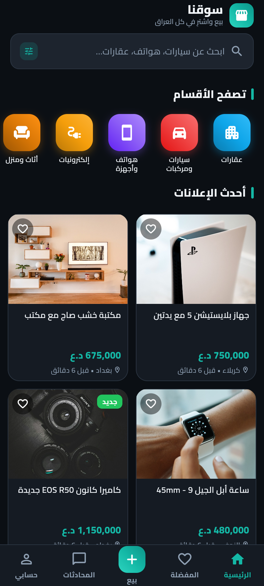
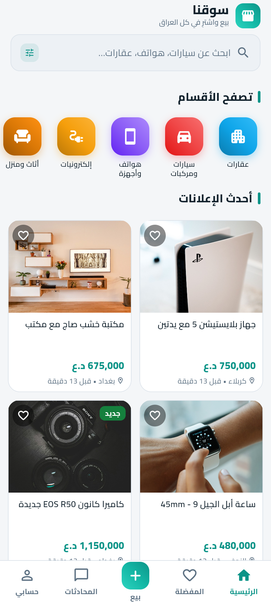
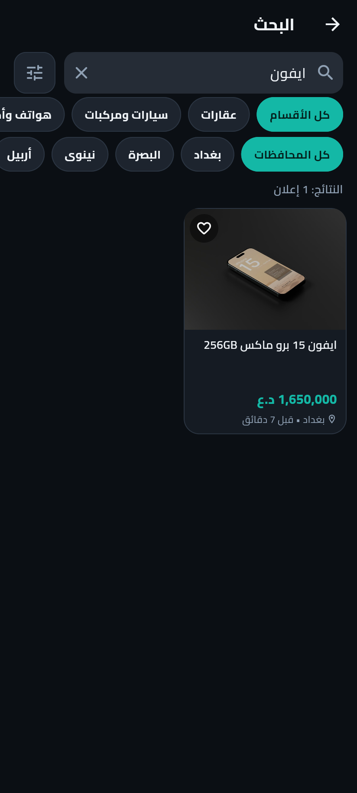
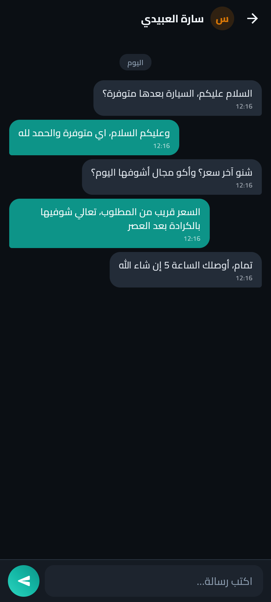
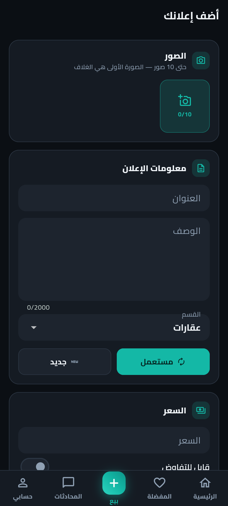
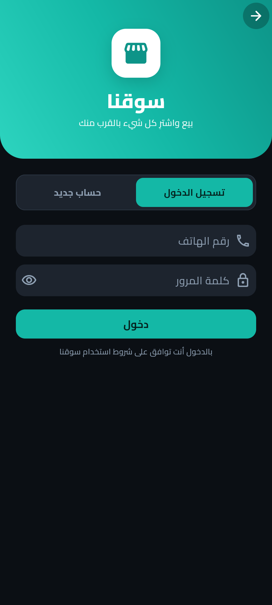
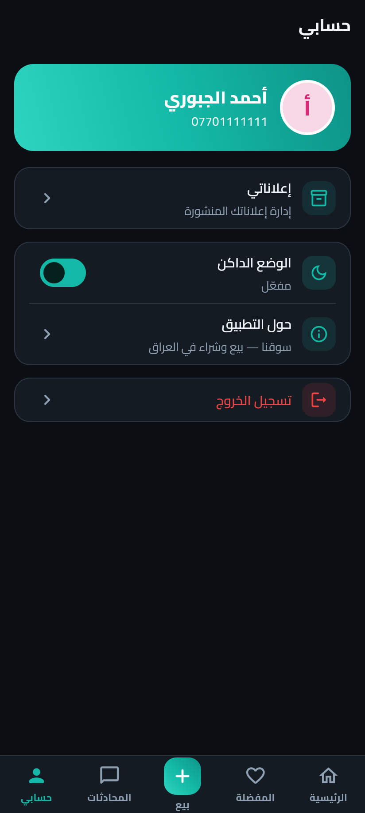
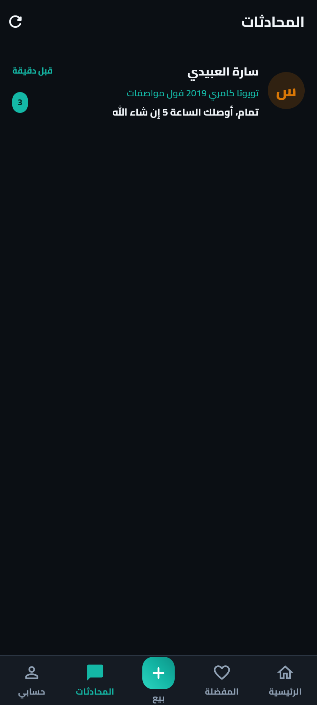

# سوقنا — Souqna 🛒

منصّة **بيع وشراء في العراق** (بأسلوب مشابه لتطبيقات الإعلانات المبوّبة مثل Kleinanzeigen،
لكن بعلامة وتصميم مختلفين). كل شيء **حقيقي** — لا بيانات وهمية: تطبيق Flutter يتصل بـ
Backend حقيقي (FastAPI + PostgreSQL) عبر REST، مع صور تُرفع وتُخزَّن فعلياً.

مبني ليعمل **تجريبياً على Raspberry Pi ثم يُنقل إلى VPS/Domain بنفس حاويات Docker**
دون إعادة بناء المشروع — فقط تتغيّر متغيّرات البيئة ورابط الـ API.

---

## البنية (Monorepo)

```
.
├── backend/            # FastAPI + SQLAlchemy(async) + Alembic + PostgreSQL
│   ├── app/            #   auth, listings, categories, favorites, messages, admin
│   ├── alembic/        #   المهاجرات (migrations)
│   ├── scripts/        #   entrypoint + backup
│   └── tests/          #   اختبارات
├── mobile/             # تطبيق Flutter (RTL عربي، ثيم داكن)
├── nginx/              # الوكيل العكسي (يخدم /media ويمرّر /api)
├── docker-compose.yml  # api + db + nginx (+ minio اختياري)
├── .env.example        # كل الإعدادات عبر متغيّرات البيئة
└── docs/DEPLOYMENT.md  # دليل النشر: Raspberry Pi → VPS + Cloudflare + HTTPS + Backup
```

## المكوّنات التقنية

| الطبقة | التقنية |
|-------|---------|
| التطبيق | Flutter (Material 3, RTL، ثيم داكن/فاتح، خط Cairo) + Dio + Provider + secure storage |
| الـ API | FastAPI (Python 3.11) + Uvicorn |
| قاعدة البيانات | PostgreSQL 16 عبر SQLAlchemy 2 (async) + مهاجرات Alembic |
| التخزين | ملفات محلية (افتراضي) أو **MinIO/S3** بتبديل متغيّر واحد |
| الحاويات | Docker + docker-compose، وNginx كوكيل عكسي |

## المميزات

- 🔐 حسابات: تسجيل/دخول، جلسة دائمة، تحديث توكن تلقائي.
- 🗂️ أقسام (تُدار من لوحة الإدارة) + 18 محافظة عراقية + تسعير بالدينار.
- 📋 إعلانات: إنشاء/تعديل/حذف، صور متعددة، حالة (نشط/مباع/مخفي)، عدّاد مشاهدات.
- 🔎 بحث وفلترة: نص + قسم + محافظة + سعر + ترتيب.
- ❤️ مفضلة، 💬 محادثات بين البائع والمشتري، 👤 ملف شخصي وإعلاناتي.
- 🌐 **موقع ويب عام (SSR عربي RTL)** على `/` — تصفّح ونشر ومحادثة من المتصفح، صديق لمحركات البحث.
- 🔔 إشعارات داخل المنصّة (رسالة/مفضلة/إشراف) + إشعارات **تيليغرام** اختيارية للمشرف.
- 🚩 بلاغات وإشراف: أسباب مصنّفة، إخفاء تلقائي بعد N بلاغات، سجل تدقيق لكل إجراء.
- 🛡️ **لوحة إدارة ويب** على `/admin` (+ نفس القدرات عبر `/api/admin`): إحصاءات، مستخدمون (حظر/أدوار)، إعلانات، بلاغات، أقسام، سجل التدقيق.

## الأمان

Argon2id لكلمات المرور · JWT (Access/Refresh مع تدوير) · Rate Limiting (slowapi) ·
تحقّق مدخلات (Pydantic) · رفع صور آمن (إعادة ترميز عبر Pillow) · أدوار وصلاحيات ·
نسخ احتياطي (pg_dump + الصور) · سجلّات · تشغيل بحاوية بمستخدم غير جذر.

---

## التشغيل السريع (خادم)

```bash
cp .env.example .env      # عدّل SECRET_KEY وكلمات المرور و PUBLIC_BASE_URL
mkdir -p data/uploads && sudo chown -R 1000:1000 data/uploads   # حاوية API غير جذرية
docker compose up -d --build
# الموقع:     http://localhost:8080        (تصفّح/نشر/محادثة من المتصفح)
# الإدارة:    http://localhost:8080/admin
# الـ API:    http://localhost:8080/api
# التوثيق:    http://localhost:8080/api/docs
```
يقوم الإقلاع تلقائياً بـ: انتظار قاعدة البيانات ← تطبيق المهاجرات ← بذر الأقسام وحساب المدير ← تشغيل الـ API.

## تشغيل التطبيق

```bash
cd mobile
flutter create . --platforms=android --org iq.souqna   # مرّة واحدة لتوليد مجلد أندرويد
flutter pub get
flutter run --dart-define=API_BASE_URL=http://10.0.2.2:8080   # محاكي أندرويد
```

**آيفون (iOS):** مجلد `ios/` مضمّن وجاهز (الاسم بالعربي، أذونات الصور، Podfile).
يتطلب macOS + Xcode — راجع قسم iOS في [mobile/README.md](mobile/README.md).

## الاختبارات

```bash
# اختبارات الخلفية (34 اختباراً، بلا Docker)
cd backend && pip install -r requirements-dev.txt && pytest

# فحص المتصفح الشامل (16 تدفق مستخدم على المكدّس الكامل)
docker compose up -d --build
pip install playwright pytest && playwright install chromium
E2E_ADMIN_PASSWORD=<من .env> python -m pytest e2e/ -v
```
التفاصيل في [docs/TEST_PLAN.md](docs/TEST_PLAN.md).

## التوثيق الكامل (docs/)

[ARCHITECTURE](docs/ARCHITECTURE.md) · [DATABASE](docs/DATABASE.md) · [API](docs/API.md) ·
[SECURITY](docs/SECURITY.md) · [DEPLOYMENT](docs/DEPLOYMENT.md) ·
[RASPBERRY_PI_DEPLOYMENT](docs/RASPBERRY_PI_DEPLOYMENT.md) ·
[MIGRATION_TO_VPS](docs/MIGRATION_TO_VPS.md) · [TEST_PLAN](docs/TEST_PLAN.md) ·
[ROADMAP](docs/ROADMAP.md) · [TASKS](docs/TASKS.md)

## لقطات من التطبيق

لقطات حقيقية (خط Cairo + بيانات فعلية من الـ API):

| الرئيسية (داكن) | الرئيسية (فاتح) | تفاصيل الإعلان |
|---|---|---|
|  |  |  |

| البحث | المحادثة | نشر إعلان |
|---|---|---|
|  |  |  |

| تسجيل الدخول | حسابي | المحادثات |
|---|---|---|
|  |  |  |

## من الراسبيري إلى VPS
راجع **[docs/DEPLOYMENT.md](docs/DEPLOYMENT.md)** — يشمل Cloudflare Tunnel وHTTPS وترحيل البيانات والنسخ الاحتياطي.

## خارطة الطريق
راجع **[docs/ROADMAP.md](docs/ROADMAP.md)** — الميزات القادمة على 4 مراحل مع معايير قبول لكل ميزة.
